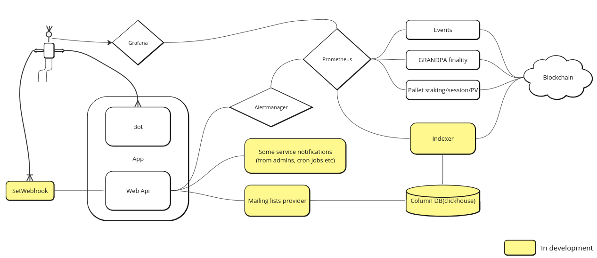

# Polkadot monitoring service
## Project overview
Monitoring as a Service in general possibility to get dashboard or subscribe on network events with using telegram bot(For experienced and demanding we also plan to provide API). Project build on top of the well known open-source monitoring solutions: Prometheus, Grafana, Alertmanager and represents a set of exporters, bot and web api.





## Two service implementations
### Portable version(current project):
* Full exporters collection (please see picture or read an explanation of each below)
* Prometheus with minimal set os alert expressions. Alert manager connected.
* Alertmanager with webhook sender and route(send alerts to bot)
* Grafana with provisioned dashboard which contains some useful graphics not more. We work nonstop on improvements and very soon will provide new version with all necessary explanations.
* Telegram bot

Everything dockerised. docker-compose.yml is presented.
> **NOTE** In **portable** version deploy of grafana and bot are independents. Bot just generate and save local values.yml file. 

### MaaS
We maintain infra and provide all necessary things. Metrics TTL = 30days.

## Bot 
Build or deploy grafana instances, subscribe on blockchain events, or just to have positive conversation with our team in rt. All it possible by Telegram bot.
In current version bot represents:
* Grafana instance deploy/destroy
* Prometheus alerts enable/disable
* Simple support
* Administrators area(group chat)

## Metrics


* `polkadot_staking_currentEra`(chain) Current era
* `polkadot_staking_eraProgress`(chain) Era progress in percents
* `polkadot_staking_totalPoints`(chain) Amount of points earned by whole network
* `polkadot_staking_eraPoints`(chain,account) Amount of points earned by validator in current era
* `polkadot_staking_validatorsChart`(chain,account) Validator's position from best to worst
* `polkadot_session_currentSession`(chain) Current session index
* `polkadot_session_sessionProgress`(chain) Session progress in percents
* `polkadot_session_validators`(chain,account) Is validator active or not
* `polkadot_session_paraValidators`(chain,account) Paravalidator or not
* `polkadot_pv_pointsMedian`(chain,account) Median ParaValidator points ratio
* `polkadot_pv_pointsAverage`(chain,account) Average ParaValidator points ratio
* `polkadot_pv_pointsP95`(chain,account) ParaValidator points ration 95 percentile
* `polkadot_pv_eraPoints`(chain,account) Amount of points earned by ParaValidator in current session
* `polkadot_pv_paraValidatorsChart`(chain,account) ParaValidator's position from best to worst
* `polkadot_finality_roundProcessed`(chain) Processed round - Rounds processed
* `polkadot_finality_prevotes`(chain,account) - Amount of success prevoutes by validators
* `polkadot_finality_precommits`(chain,account) - Amount of success precommits by validators (became to 2/3)
* `polkadot_events`(chain,module,method) - Occurred on-chain events counter
* `polkadot_events_by_account`(chain,module,method,account) - Occurred on-chain events with validator account
    * Event examples `Balances.Deposit`, `Balances.Locked`, `Balances.Reserved`, `Balances.Transfer`, `Balances.Unlocked`, `Balances.Upgraded`, `Balances.Withdraw`, `ImOnline.SomeOffline`, `Proxy.ProxyAdded`, `Staking.Bonded`, `Staking.Chilled`, `Staking.PayoutStarted`, `Staking.Rewarded`, `Staking.SlashReported`, `Staking.Unbonded`, `Staking.ValidatorPrefsSet`, `Staking.Withdrawn`, `TransactionPayment.TransactionFeePaid`, `VoterList.Rebagged`, `VoterList.ScoreUpdated`
    * `ParasDisputes.DisputeConcluded` - accounts considering candidate is Invalid, but majority conclusion = Valid

## How to run

1. Install Docker and Docker Compose from https://docs.docker.com/engine/install/ or any other compose compatible tool and container runtime

2. (Optional) Add RPC endpoints to config files `polkadot.env` and `kusama.env` in the following format:

```
WS_ENDPOINT="ws://your-node1:9944"
WS_ENDPOINTS="http://your-node1:9944,http://your-node2:9944,http://your-node3:9944/"
```
3. Configure bot by adding telegram bot api token and group chatId for administrators to `bot.env` Use `@botfather` to create bot. 

4. Run the project:
    * via make:
        * `make` - start both polkadot and kusama exporters
        * `make polkadot` - start only polkadot part
        * `make kusama` - start only kusama part
        * `make clean` - stop and destroy
    * directly via docker-compose:
        * `docker-compose -f docker-compose.yml -f polkadot.yml -f kusama.yml up`-  will start exporters for polkadot and kusama
        * `docker-compose -f docker-compose.yml -f polkadot.yml up` - will start exporters only for polkadot
        * `docker-compose -f docker-compose.yml -f kusama.yml up` - will start exporters only for kusama

## How to use and test
1. Inspect the [dashboard](http://127.0.0.1:3000/d/fDrj0_EGz/p2p-org-polkadot-kusama-dashboard?orgId=1) (default username and password `admin`, `admin`)

2. Contact with your bot. Command `/start` will be good:)

3. Try to build or destroy grafana instance(actually only `values.yml` generates)

4. Subscribe/Unsubscribe on alerts from prometheus. You can always add your own expressions to `prometheus/alerts.yml`

### References

* https://github.com/polkascan/py-substrate-interface - Python Substrate Interface. Many thanks to `Stichting Polkascan (Polkascan Foundation)` for amazing library implimentation which successfully used in exporters.
* https://github.com/itering/scale.go - Go implementation of scale codec
* https://wiki.polkadot.network/ - Polkadot Wiki
* https://polkadot.js.org/docs/ - Good to know
